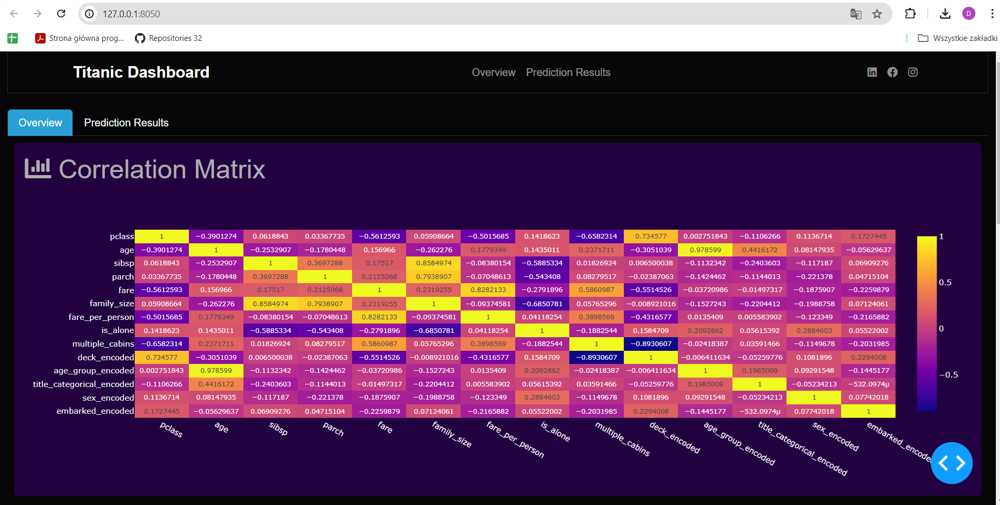
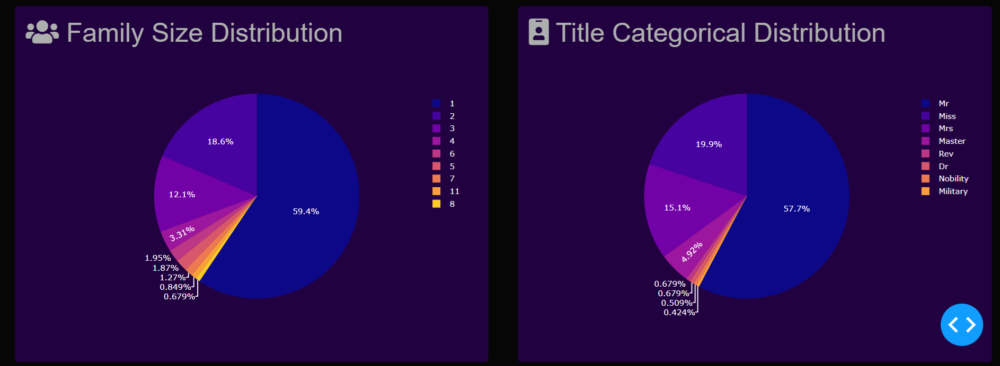
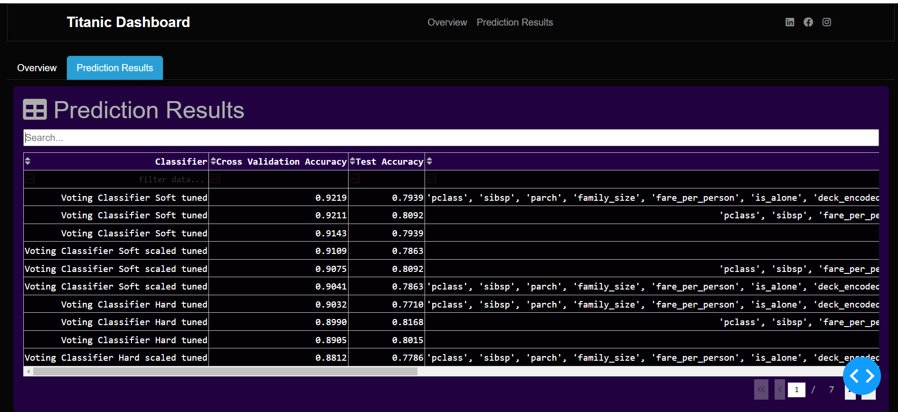

### First Project -- Titanic Survival Prediction: 
Developed a machine learning model using Python and Scikit-learn with advanced preprocessing and feature engineering. Achieved high accuracy with XGBoost and LightGBM. Deployed via a Django web application.

### Second Project --Titanic Results Dashboard
# Titanic Dashboard

This project visualizes and analyzes the Titanic dataset using various machine learning classifiers and interactive plots.

## Overview

### Correlation Matrix

### Age Distribution and Survival Analysis

### Pie Charts

## Prediction Results

